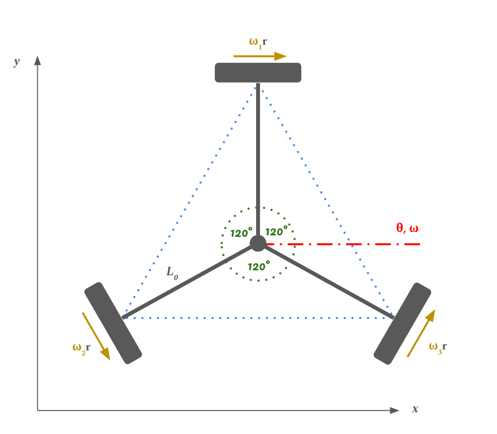
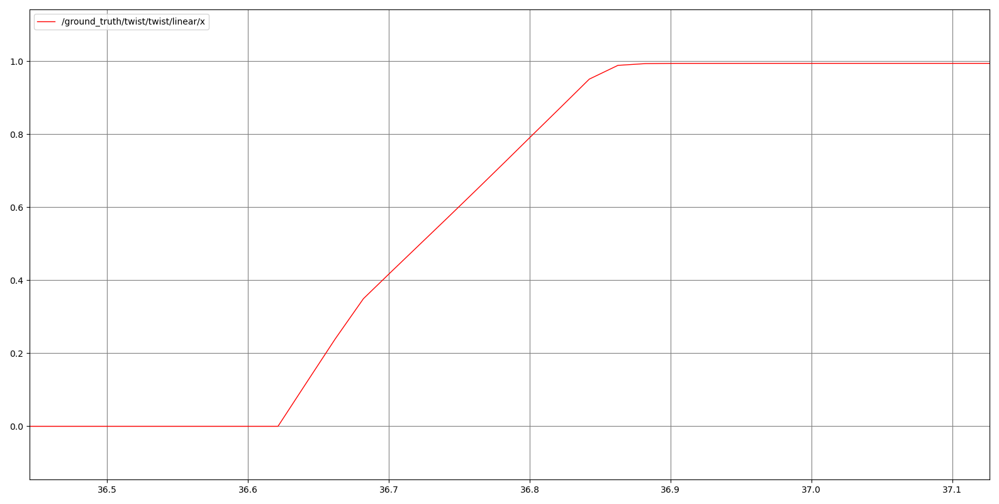
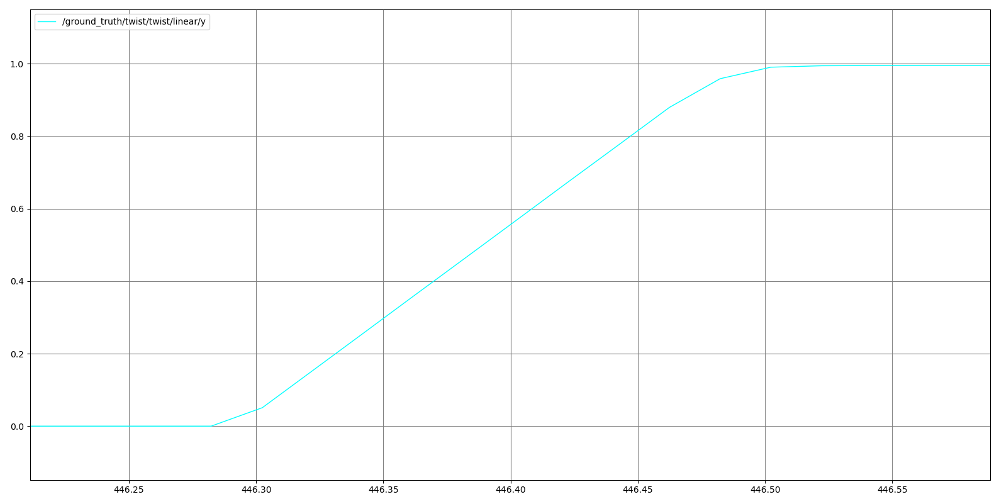
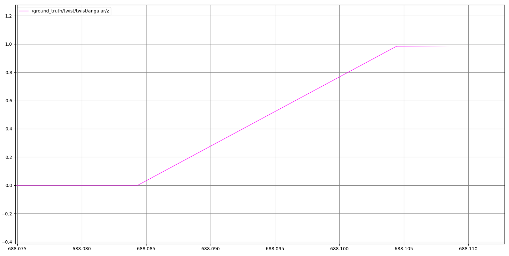

# Final Project: Omni-Wheel Robot Odometry with Kalman Filter Sensor Fusion

A ROS 2 project implementing odometry for a three-wheeled omni-directional robot (equilateral triangle configuration) by fusing wheel encoder data with IMU measurements using both Unscented Kalman Filter (UKF) and Extended Kalman Filter (EKF) approaches.

## Overview

This is a final project for EEME6911 Topics in Control: Probabilistic Robotics. Our primary contributions are:

1. **Deriving a motion model** for the omni-wheel drivetrain (three wheels in an equilateral triangle configuration)
2. **Implementing two odometry estimation approaches**: UKF-based and EKF-based sensor fusion
3. **Providing ground truth comparison** via Gazebo link states for algorithm validation
4. **Integrating with Nav2** for AMCL-based localization

The project includes a complete simulation environment built on ROS 2 Humble and Gazebo, with the robot model, control interfaces, kinematics nodes, and localization capabilities.

---

## Table of Contents

- [Robot Platform](#robot-platform)
- [Repository Structure](#repository-structure)
- [Simulation Environment Setup](#simulation-environment-setup)
- [Motion Model Derivation for UKF](#motion-model-derivation-for-ukf)
- [Motion Model for EKF](#motion-model-for-ekf)
- [Odometry Implementation](#odometry-implementation)
- [Results](#results)
- [Installation & Usage](#installation--usage)
- [Team Members](#team-members)
- [References](#references)

---

## Robot Platform
The LeKiwi robot uses three omni-directional wheels arranged in an equilateral triangle, with the URDF adapted from the original [SIGRobotics-UIUC/LeKiwi](https://github.com/SIGRobotics-UIUC/LeKiwi) repository.

**insert diagram of lekiwi top down**

- **Wheel 1 (back):**
- **Wheel 2 (front right):**
- **Wheel 3 (front left):**

Each wheel is driven by an ST3215 servo motor.

---

## Repository Structure

```
src/
├── model_description/          # Robot URDF/meshes
│   ├── urdf/
│   │   └── LeKiwi_simplified.urdf
│   │   └── LeKiwi_simplified_lidar.urdf
│   ├── meshes/
│   └── launch/
│       └── display.launch.py
│
├── model_gazebo/               # Gazebo simulation & control
│   ├── launch/
│   │   └── model_in_gazebo.launch.py
│   ├── config/
│   │   └── controllers.yaml
│   ├── model_gazebo/
│   │   ├── vel_cmd_to_wheel.py     # Inverse kinematics node
│   │   ├── ukf_odometry.py         # UKF odometry implementation
│   │   └── ground_truth_pub.py     # Gazebo ground truth publisher
│   └── worlds/
│       └── jackal_race.world
│
├── odom_ekf/                   # EKF odometry package
│   ├── launch/
│   │   └── odom_ekf.launch.py
│   └── odom_ekf/
│       └── odom_ekf.py          # EKF odometry implementation
│
└── model_navigation/           # Navigation & localization
    ├── launch/
    │   └── localization.launch.py
    ├── config/
    │   └── amcl_config.yaml
    ├── maps/
    │   └── jackal_race.yaml
    └── rviz/
        └── amcl_local.rviz
```

---

## Simulation Environment Setup

Getting an omni-wheel robot to simulate correctly in Gazebo required substantial integration work. This section documents the effort involved.

### URDF Configuration

The robot model was converted from CAD to URDF with the following considerations:

- **Inertial properties:** We ran a script to prune collision elements and inertias from the urdf tree so that the robot had a neutral center of mass and inertia tensors for stable simulation
- **Sensors & Actuators:** Integrated 6-DOF IMU, Camera/LiDAR plugins, and velocity-controlled wheel actuators in `<gazebo>`.
- **ros2_control integration:** Added `<ros2_control>` tags to define the hardware interface for Gazebo
- **Collision geometry:** Simplified collision meshes for performance. Wheels themselves treated as cylinders 
- **Omni-wheel friction:** Configured asymmetric friction (low lateral, normal longitudinal) to approximate omni-wheel behavior in Gazebo
- **Model Variants:**
  - `LeKiwi_simplified.urdf`: The standard version retaining the mechanical arm structure, equipped with general sensors of **Encoders/actuator** and **imu**.
  - `LeKiwi_simplified_cam.urdf`:equipped with a **Depth Camera** in addition
  - `LeKiwi_simplified_lidar.urdf`: A highly simplified version for localization, where the upper arm mechanism is removed to accommodate a **2D LiDAR**.

### ros2_control Integration

We used `ros2_control` with `gazebo_ros2_control` to interface with the simulated robot:

| Component | Purpose |
|-----------|---------|
| `JointStateBroadcaster` | Publishes joint positions/velocities to `/joint_states` |
| `JointGroupVelocityController` | Accepts velocity commands for all three wheels |
| `IMU Sensor Plugin` | Simulates a 6-DOF IMU, publishing linear acceleration and angular velocity with their covariances to `/imu` |
| `Ray Sensor (LiDAR) Plugin` | Simulates a 2D LiDAR scanner, publishing laser scan data to `/scan` |
| `Depth Camera Plugin` | Simulates a depth camera, publishing RGB images, depth images, and point clouds to `/camera/...` |


**Controller configuration** (`controllers.yaml`):
```yaml
omni_wheel_controller:
  ros__parameters:
    joints:
      - ST3215_Servo_Motor-v1-2_Revolute-60   # Wheel 1
      - ST3215_Servo_Motor-v1-1_Revolute-62   # Wheel 2
      - ST3215_Servo_Motor-v1_Revolute-64     # Wheel 3

gazebo_ros2_control:
  ros__parameters:
    gains:
      ST3215_Servo_Motor-v1-2_Revolute-60: {p: 1.0, i: 0.0, d: 0.5}
      ST3215_Servo_Motor-v1-1_Revolute-62: {p: 1.0, i: 0.0, d: 0.5}
      ST3215_Servo_Motor-v1_Revolute-64: {p: 1.0, i: 0.0, d: 0.5}
```
this ensures that published wheel velocities are not instantaneously achieved (more physical)

### Inverse Kinematics Low-level control Node

The `vel_cmd_to_wheel` node subscribes to `/cmd_vel` (body-frame velocity) and publishes individual wheel angular velocities to the controller.

**Inverse kinematics equations (also see [Motion Model](#motion-model-derivation)):**

$$
\begin{aligned}
\omega_1 &= \frac{-v_x - \omega L}{r} \\
\omega_2 &= \frac{\cos(60^\circ)v_x - \cos(30^\circ)v_y - \omega L}{r} \\
\omega_3 &= \frac{\cos(60^\circ)v_x + \cos(30^\circ)v_y - \omega L}{r}
\end{aligned}
$$

Where:
- $v_x, v_y$: Linear velocity components in the body frame
- $\omega$: Angular velocity (yaw rate)
- $L$: Distance from wheel to robot center ($0.132$ m)
- $r$: Wheel radius ($0.1$ m)

**ROS 2 topics:**
- Subscribes: `/cmd_vel` (`geometry_msgs/Twist`)
- Publishes: `/omni_wheel_controller/commands` (`std_msgs/Float64MultiArray`)

<!-- 
### Screenshots / Videos
TODO: Add simulation screenshots or video links here
- Robot spawning in Gazebo
- Driving with teleop
- Verifying motion in different directions
-->

---

## Motion Model Derivation for UKF

For our robot in Gazebo, the environment is perfectly flat and we assume that the only degrees of freedom of interest are planar translation and rotation about the vertical axis.

<div align="center">

</div>

### 1. State Vector ($\mathbf{x}$) and Input Vector ($\mathbf{u}$)
The state vector ($6 \times 1$) tracks global pose and body-frame velocities. The control input comes strictly from the **IMU**.
(Note: $a_x, a_y$ are proper accelerations in the Body Frame).

$$
\mathbf{x} = \begin{bmatrix}
p_x \\
p_y \\
\theta \\
v_x \\
v_y \\
\omega
\end{bmatrix}
\quad\quad, \quad \quad
\mathbf{u} = \begin{bmatrix}
a_x \\
a_y \\
\omega_{gyro}
\end{bmatrix}
$$

- $p_x$: Global X Position (m)  
- $p_y$: Global Y Position (m)  
- $\theta$: Global Yaw (rad)  
- $v_x$: Body-frame Velocity X (m/s)  
- $v_y$: Body-frame Velocity Y (m/s)  
- $\omega$: Angular Velocity (rad/s)

$\theta$ is defined to be counterclockwise-positive from the +x axis.

### 2. Motion Model ($f$)
This is the system dynamics function $\mathbf{x}_{k+1} = f(\mathbf{x}_k, \mathbf{u}_k)$.
We integrate the accelerometer inputs to update linear velocity, and we use the gyro input to drive the angular velocity state directly.

$$
\mathbf{x}_{k+1} = \begin{bmatrix}
p_{x, k} + (v_{x, k} \cos \theta_k - v_{y, k} \sin \theta_k) \Delta t \\
p_{y, k} + (v_{x, k} \sin \theta_k + v_{y, k} \cos \theta_k) \Delta t \\
\theta_k + \left( \frac{\omega_k + \omega_{gyro}}{2} \right) \Delta t \\
v_{x, k} + a_x \Delta t \\
v_{y, k} + a_y \Delta t \\
\omega_{gyro}
\end{bmatrix}
$$

### 3. Measurement model ($z$)
The measurement comes strictly from the **Wheel Encoders**.
(Note: $r$ is each wheel radius)

$$
\mathbf{z} = \begin{bmatrix}
\omega_1 \\
\omega_2 \\
\omega_3
\end{bmatrix}
$$

The function $\hat{\mathbf{z}} = h(\mathbf{x})$ maps the current predicted state to the expected sensor readings using the Forward Kinematics matrix $J$.

$$
h(\mathbf{x}) = \frac{1}{r} J \cdot
\begin{bmatrix}
p_x \\
p_y \\
\theta \\
v_x \\
v_y \\
\omega
\end{bmatrix}
$$

$$
h(\mathbf{x}) = \frac{1}{r}\begin{bmatrix}
0 & 0 & 0 & -1 & 0 & -L_0 \\
0 & 0 & 0 & \sin{\frac{\pi}{6}} & -\cos{\frac{\pi}{6}} & -L_0 \\
0 & 0 & 0 & \sin{\frac{\pi}{6}} & \cos{\frac{\pi}{6}} & -L_0
\end{bmatrix}
\begin{bmatrix}
p_x \\
p_y \\
\theta \\
v_x \\
v_y \\
\omega
\end{bmatrix}
$$

$$
h(\mathbf{x}) = \frac{1}{r} \begin{bmatrix}
-v_x + L_0 \omega \\
0.5 v_x - \frac{\sqrt{3}}{2} v_y - L_0 \omega \\
0.5 v_x + \frac{\sqrt{3}}{2} v_y - L_0 \omega
\end{bmatrix}
$$

The measurement model is actually linear w.r.t the state. This means we won't need to sample from it to build a gaussian for the UKF, we can directly combine it with the prediction and measurement uncertainties (in measurement space) to build the Kalman Gain.

---

## Motion Model for EKF

### 1. State Vector ($\mathbf{x}$) and Input Vector ($\mathbf{u}$)

The state vector here is also the same as the UKF:

$$
\mathbf{x} = \begin{bmatrix} p_x & p_y & \theta & v_x & v_y & \omega \end{bmatrix}^\top
$$

where:

- $p_x, p_y$ denote the robot’s planar position in the global frame,
- $\theta$ represents the robot’s yaw angle (heading),
- $v_x, v_y$ are the linear velocities of the robot expressed in the robot body frame,
- $\omega$ is the angular velocity around the vertical (z) axis.

But the control input to the system is defined as:

$$
\mathbf{u} = \begin{bmatrix} v_x & v_y & \omega \end{bmatrix}^\top
$$

where:

- $v_x, v_y$ are the commanded linear velocities in the robot body frame,
- $\omega$ is the commanded angular velocity.

These inputs correspond to the control commands processed by the vel_cmd_to_wheel node. So we can get them directly from the "cmd_vel" topicss

### 2. Motion Model

To better match the observed Gazebo-simulation behavior where the actual velocities do not instantaneously track `cmd_vel`, we model the system with:
1) world-frame position kinematics (integrating body-frame velocities into world-frame pose)  
2) a first-order velocity response model (actuator dynamics) for the three commanded velocities.


#### 2.1 Planar kinematics (body → world)

The state velocities $v_x, v_y$ are expressed in the robot body frame (`base_link`), while $(p_x, p_y, \theta)$ are expressed in the global frame (`odom/world`). 

With sampling period $\Delta t$, the updated equation for the pose states:


$$
\begin{aligned}
p_{x,k+1} &= p_{x,k} + (v_{x,k}\cos\theta_k - v_{y,k}\sin\theta_k)\Delta t \\
p_{y,k+1} &= p_{y,k} + (v_{x,k}\sin\theta_k + v_{y,k}\cos\theta_k)\Delta t \\
\theta_{k+1} &= \theta_k + \omega_k \Delta t
\end{aligned}
$$

#### 2.2 First-order velocity response

From the ground-truth step responses of $v_x$, $v_y$, and $\omega$ (see plots below), the velocity tracking behavior is well approximated by a first-order system. We therefore model:

$$
\begin{aligned}
v_{x,k+1} &= v_{x,k} + \frac{\Delta t}{\tau_x}(u_{v_x,k}-v_{x,k}) \\
v_{y,k+1} &= v_{y,k} + \frac{\Delta t}{\tau_y}(u_{v_y,k}-v_{y,k}) \\
\omega_{k+1} &= \omega_k + \frac{\Delta t}{\tau_\omega}(u_{\omega,k}-\omega_k)
\end{aligned}
$$

where the time constants are approximated from the step-response curves:
- $\tau_x \approx 0.13\,\mathrm{s}$
- $\tau_y \approx 0.14\,\mathrm{s}$
- $\tau_\omega \approx 0.013\,\mathrm{s}$

<div align="center">
  
  
  
</div>
<div align="center">

</div>

## 3. Measurement

The EKF uses two sensor sources:
- **Wheel encoders**: wheel angular velocities from the `/joint_states` topic with made up covarience.
- **IMU**: yaw-rate measurement (angular velocity about the z-axis) from the `/imu` topic with gaussian covarianve.

We define the measurement vector as:

$$
\mathbf{z}_k =
\begin{bmatrix}
\omega_{1,k} \\
\omega_{2,k} \\
\omega_{3,k} \\
\omega^{imu}_k
\end{bmatrix}
$$

where ω<sub>1,k</sub>, ω<sub>2,k</sub>, ω<sub>3,k</sub> are the three wheel angular velocities (encoder readings), and ω<sub>imu,k</sub> is the IMU-measured yaw rate.

In implementation, this is a **linear** measurement model, developed from inverse kinematics of command to wheel velocities, also basically the same as UKF.

---
## Odometry Implementation

We implemented two distinct Kalman filter approaches for state estimation, both tracking a 6-DOF state vector ($x \in \mathbb{R}^6$: position, orientation, and body-frame velocities).

### UKF Odometry (`ukf_odometry.py`)

Implements a hybrid **Unscented Kalman Filter (Prediction)** and **Linear Kalman Filter (Correction)**:

* **Prediction (IMU):** Propagates nonlinear dynamics $x_{k+1} = g(x_k, u_{imu}, \Delta t)$ using the Unscented Transform with sigma points to handle process noise
* **Correction (Encoders):** Performs standard linear Kalman updates via observation model $z = C\mathbf{x}$ using wheel velocities from `/joint_states`
* **Noise modeling:** Artificially corrupts encoder measurements with 2% velocity-proportional Gaussian noise for robustness testing
* **Interfaces:** Subscribes to `/imu`, `/joint_states`; publishes `/ukf_odometry`

### EKF Odometry (`odom_ekf.py`)

Implements a first-order **Extended Kalman Filter** with synchronized sensor fusion:

* **Sensor synchronization:** Uses `ApproximateTimeSynchronizer` to align IMU and encoder data (40ms tolerance)
* **Prediction:** Linearizes dynamics via Jacobian $G_x$ to propagate state and covariance; incorporates `/cmd_vel` as control input with first-order lag dynamics
* **Correction:** Fuses wheel encoder velocities and IMU gyroscope in a single update step using observation model $H$
* **Interfaces:** Subscribes to `/imu`, `/joint_states`, `/cmd_vel`; publishes `/odom` and broadcasts `odom` $\to$ `base_link` TF

### Ground Truth Publisher (`ground_truth_pub.py`)

Extracts and republishes Gazebo's internal link state data for algorithm validation:

* Subscribes to `/gazebo/link_states` and filters for `base_link`
* Publishes:
  - `/ground_truth/pose` (`PoseStamped`): Global pose with yaw-only orientation
  - `/ground_truth/twist` (`TwistStamped`): Body-frame velocities transformed from world frame
* Enables direct comparison of odometry estimates against simulation truth

---

## Navigation & Localization

The `model_navigation` package provides AMCL-based localization capabilities:

* **Map:** Pre-built map of the `jackal_race.world` environment
* **AMCL:** Adaptive Monte Carlo Localization using particle filter for global pose estimation
* **Launch file:** `localization.launch.py` starts map server, AMCL node, and RViz with custom configuration
* **Integration:** Uses odometry from either UKF or EKF node as motion model input

This enables testing of odometry quality by observing particle convergence and localization accuracy in RViz.

---

## Results

Both UKF and EKF implementations successfully fuse IMU and wheel encoder data to produce stable odometry estimates. The ground truth publisher facilitates comparison of drift and accuracy between these two approaches. Both methods produce comparible performance and there is no significant difference.

Integration with AMCL localization confirms that both odometry sources provide sufficient accuracy for particle filter convergence in the mapped environment.

---

## Installation & Usage

### Dependencies

- ROS 2 Humble
- Gazebo Classic
- `gazebo_ros_pkgs`
- `ros2_control`
- `gazebo_ros2_control`
- `turtlebot3_gazebo` (world file integration)

*these should be included in the installation script from class*

### Building

```bash
cd /path/to/Prob_Project_ws
colcon build
source install/setup.bash
```

### Running the Simulation

Launch Gazebo with the robot (includes UKF odometry and ground truth publisher):
```bash
ros2 launch model_gazebo model_in_gazebo.launch.py
```

**Or** launch with EKF odometry instead:
```bash
ros2 launch model_gazebo model_in_gazebo.launch.py  # in one terminal
ros2 launch odom_ekf odom_ekf.launch.py             # in another terminal
```

### Running Localization

After launching the simulation, start AMCL localization:
```bash
ros2 launch model_navigation localization.launch.py
```

This will open RViz with the map and particle cloud visualization.

---

## Known Issues / Future Work

This project has shown that the LeKiwi omniwheel robot can be effectively simulated in Gazebo, and both UKF and EKF implementations successfully fuse sensor data to produce usable odometry. However, odometry alone accumulates drift over time, and the omniwheel configuration exhibits more slip than traditional differential drive platforms like the Turtlebot.

The AMCL integration demonstrates that exteroceptive sensing (LIDAR-based localization) can correct this drift effectively. Future work could include:

* Quantitative comparison of UKF vs EKF drift rates under various motion patterns
* Vision-based landmark recognition for improved localization
* Full Nav2 integration with autonomous navigation
* Manipulation tasks using the robot's arm (currently disabled in simulation)

---

## Team Members

- Darren Biskup (db3728)
- Han He (hh3102)

---

## References

* Lynch, K. M., & Park, F. C. (2017). *Modern Robotics: Mechanics, Planning, and Control* (Chapter 13: Wheeled Mobile Robots). Cambridge University Press.
* Thrun, S., Burgard, W., & Fox, D. (2005). *Probabilistic Robotics*. MIT Press.
* Hu, S., Chen, H., & Shao, Y. (2020). Triangular Omnidirectional Wheel Motion Control System. *Open Access Library Journal*, 7: e6677. [https://doi.org/10.4236/oalib.1106677](https://www.scirp.org/journal/paperinformation?paperid=102349)

---

## License

This project is licensed under the MIT License - see the [LICENSE](LICENSE) file for details.
